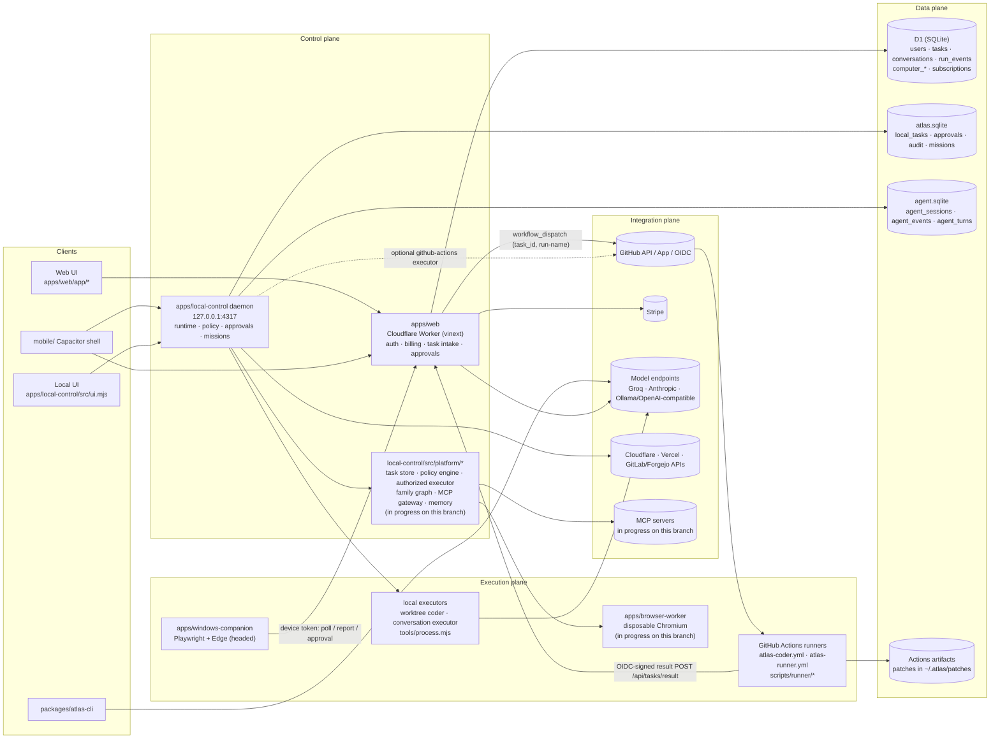
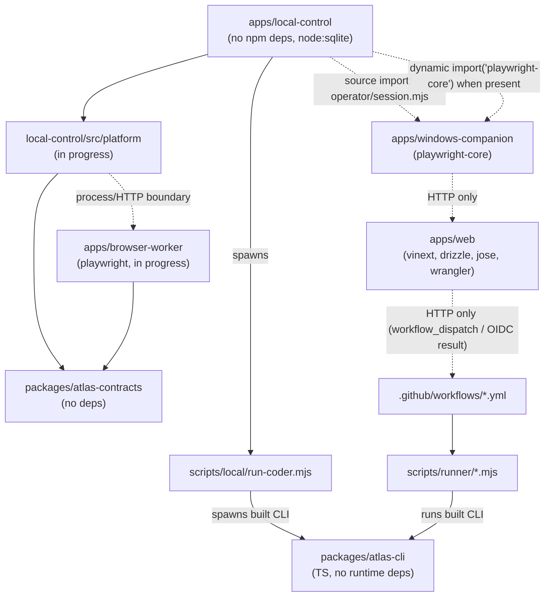

# Atlas OS — architecture

Maps the blueprint's four planes onto the components that exist in this
repository (see `AUDIT.md` for evidence) and records the decisions this branch
is built on. Items marked *(in progress on this branch)* are being built now by
sibling work and do not exist at base commit `4ce465e`.

## 1. Planes mapped to components

Notes on the diagram (all verified in code):

- `apps/web` never executes work itself: `POST /api/tasks` dispatches a GitHub
  workflow or forwards to `ATLAS_AGENT_DISPATCH_URL`
  (`apps/web/app/api/tasks/route.ts:56-90`).
- The companion is pull-based: it leases `computer_tasks` rows through
  `apps/web/app/api/computer/companion/poll/route.ts`.
- The daemon imports the companion's operator session directly
  (`apps/local-control/src/main.mjs:175-178`) — a cross-app source import, not a
  package dependency.
- The two local SQLite files are opened by different classes
  (`src/store.mjs:12`, `src/agent/session-store.mjs:21`) and share no transaction.

## 2. Module dependency map

Solid arrows are code imports or spawns found in source; dotted arrows are
runtime-only (HTTP, dynamic import, or cross-directory relative import).
`packages/atlas-contracts` has no importers at the base commit; the edges from
`platform` and `browser-worker` are the intended wiring for this branch.

## 3. Architecture decision records

### ADR-001 — Contracts are dependency-free JavaScript in `packages/atlas-contracts`

- **Status:** accepted (package added in `4ce465e`).
- **Context:** Records cross three runtimes (Worker, Node daemon, Actions job).
  `apps/local-control` must install without an npm registry
  (`src/agent/tool-registry.mjs:29-33` states the same rule for its validator).
  Budget vocabularies already drift: `elapsedMs` locally
  (`src/agent/budget.mjs:7`) vs `wallTimeMs` in the contract
  (`packages/atlas-contracts/src/index.mjs:249`).
- **Decision:** One ESM module, `schemaVersion: "atlas.v1"`, prefixed ids
  (`tsk_`, `cor_`, …), canonical-JSON digests, a JSON-Schema subset validator,
  and the task state machine. No build step, no dependencies.
- **Consequences:** Every plane can import it directly. Budget naming must be
  reconciled (map `elapsedMs` ↔ `wallTimeMs` at the boundary or rename one).
  `apps/web` is TypeScript; it can import `.mjs` but gets no types unless a
  `.d.ts` is added.

### ADR-002 — Durable execution state lives in local-control SQLite with a transactional outbox

- **Status:** accepted; implementation in progress on this branch
  (`apps/local-control/src/platform/`).
- **Context:** The daemon already persists sessions, events and leases with
  `BEGIN IMMEDIATE` sequence allocation (`src/agent/session-store.mjs:129-140`)
  and enforces append-only mission events with triggers (`src/store.mjs:52-53`).
  Live fan-out is in-memory listeners (`src/agent/runtime.mjs` `#listeners`), so
  an event can be committed but never delivered, or delivered but not committed.
- **Decision:** Task, step, tool-call and approval state transitions are
  written in the same SQLite transaction as an outbox row; a relay publishes
  outbox rows (to listeners, to `apps/web`, to workers) and marks them sent.
  State transitions are validated with `assertTransition` from the contracts.
- **Consequences:** At-least-once delivery; consumers dedupe by event id.
  D1 stays the hosted system-of-record for tenancy, billing and user-visible
  history, not for execution state.

### ADR-003 — The web Worker orchestrates but never hosts long-lived jobs

- **Status:** accepted (codifies current behaviour).
- **Context:** `apps/web/worker/index.ts` exports only `fetch`; bindings are
  `ASSETS`, `DB`, `IMAGES`. There are no Queues, Durable Objects, Workflows, Cron
  Triggers or Browser Rendering bindings. Every outbound call is bounded to 10 s
  (`app/api/tasks/dispatch.mjs:66`, `app/api/tasks/result/route.ts:33`).
- **Decision:** `apps/web` does intake, authn/z, plan gating, approval capture,
  queue-row writes and status projection. Execution happens on GitHub Actions,
  the local daemon, the companion, or the browser worker.
- **Consequences:** The "Cloudflare hosted browser" option
  (`app/api/computer/tasks/route.ts:52-58`) needs a real consumer (browser
  worker or a Browser Rendering binding) before it is offered; today such tasks
  have no executor.

### ADR-004 — The browser worker is a separate package

- **Status:** accepted; in progress on this branch (`apps/browser-worker/`).
- **Context:** `apps/local-control` has zero npm dependencies and loads
  Playwright only by optional dynamic import
  (`src/agent/browser/playwright-page.mjs:27-33`); the companion depends on
  `playwright-core@1.55.0` and drives a persistent, headed Edge profile
  (`apps/windows-companion/src/index.mjs:16-18`).
- **Decision:** Disposable, per-session Chromium lives in its own package that
  speaks the contracts over a process/HTTP boundary, implementing the same page
  contract as `playwright-page.mjs` and `cloudflare-browser.mjs`.
- **Consequences:** The local control plane stays registry-free; the browser
  worker can be deployed on a VM/container without the daemon; profiles are
  ephemeral by default (unlike the companion's persistent profile).

### ADR-005 — Policy decisions are deterministic and separate from the model

- **Status:** accepted; engine in progress on this branch.
- **Context:** Existing gates are already deterministic: tool policy
  allow/ask/deny with default deny (`src/agent/tool-registry.mjs:136,193-203`),
  browser action classification (`apps/windows-companion/src/operator/classification.mjs:4-10`),
  and digest-bound one-time approvals (`tool-registry.mjs:89-95`).
- **Decision:** A single policy engine evaluates (actor, tenant, tool, risk,
  input digest, budget) → `allow | deny | require_approval` and records a
  `policyDecision` record; the authorized executor refuses to run a tool call
  without one and charges the budget before execution.
- **Consequences:** The three existing gates become inputs to one engine
  instead of three parallel code paths.

### ADR-006 — Correlation ids propagate from web intake to runner results

- **Status:** accepted; in progress on this branch (web coder dispatch).
- **Context:** Today tasks are joined across web↔Actions by `task_id` and a
  `run-name` string (`.github/workflows/atlas-coder.yml:7`,
  `app/api/tasks/runner-result.mjs:38`). No `correlation` identifier exists in
  `apps/web/app`, `apps/local-control/src` or `scripts/`.
- **Decision:** Mint/accept a `cor_…` id with `acceptCorrelationId`
  (`packages/atlas-contracts/src/index.mjs:67`), pass it as a dispatch input,
  and stamp it on every event and result.
- **Consequences:** Adding a workflow input requires updating
  `atlas-coder.yml` inputs and `scripts/runner/validate-inputs.mjs`, and running
  `.github/atlas/check-workflows.py`.
