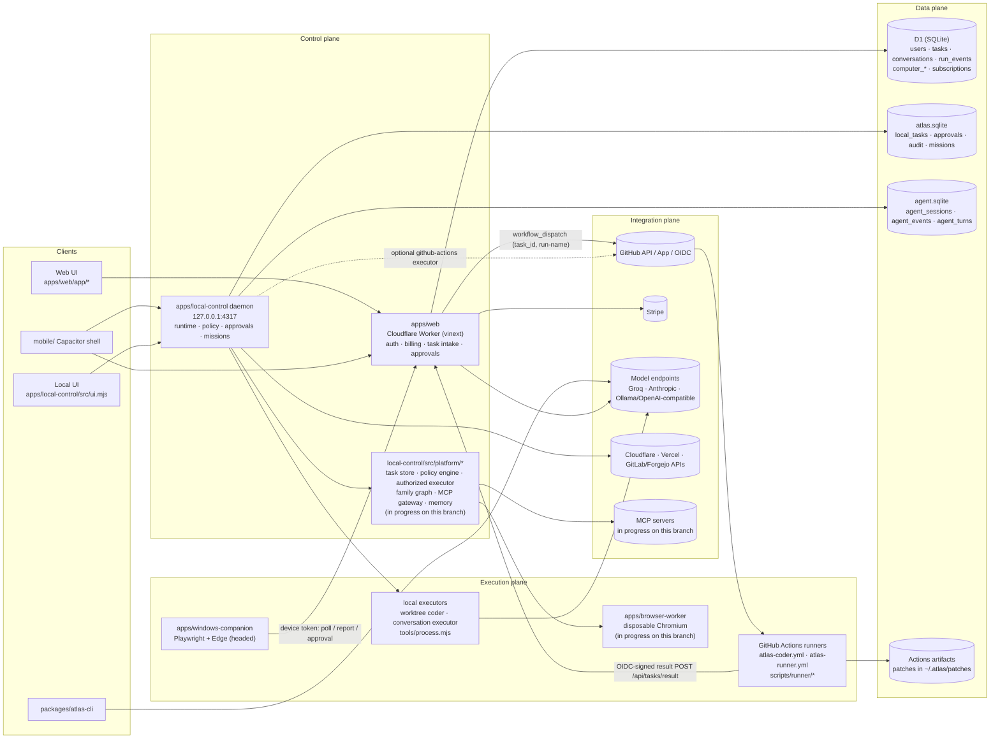
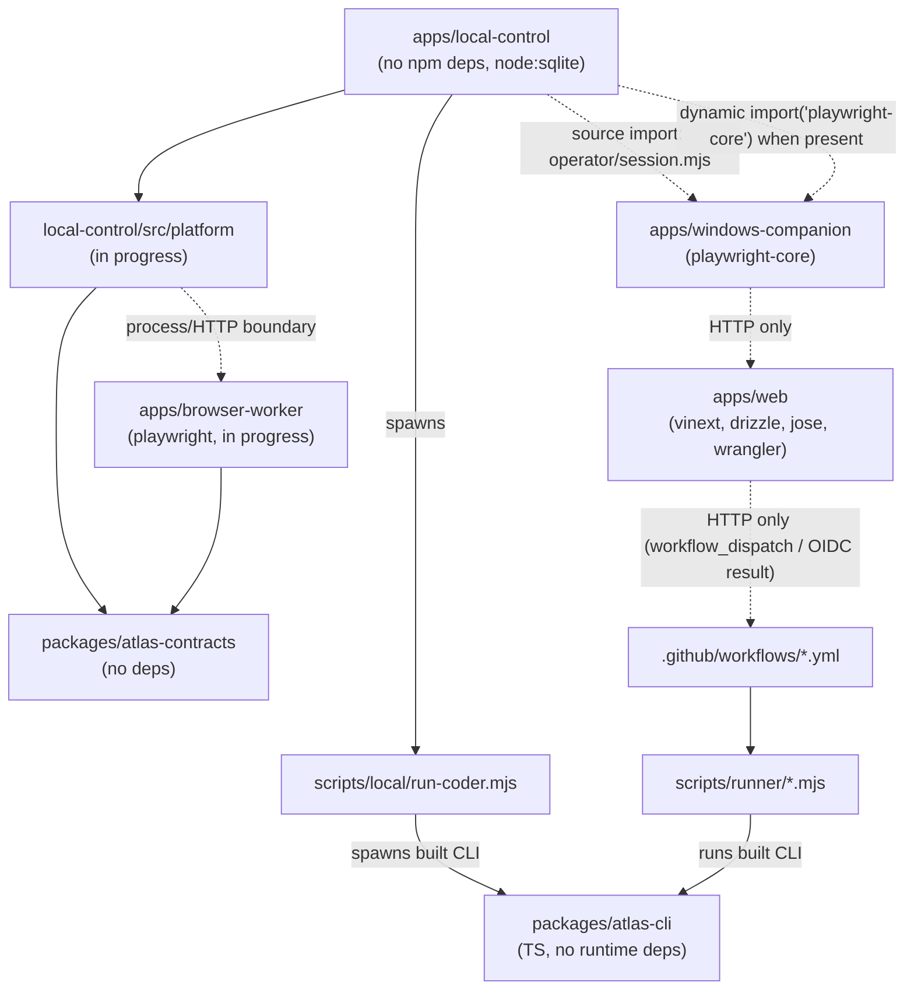

# Atlas architecture and production audit — 2026-10-08

Snapshot: remote `main` `17570ff348baef91a7637153df93538d56629762`.
Workstream: #244, `codex/cloud-result-recovery`. This section supersedes the
September architecture claims below; it does not declare all production gates passed.
The governing program is `docs/PROGRAM.md` (no root `PROGRAM.md` exists).
Read `docs/ROADMAP.md`, `docs/TODO-MAP.md`, `docs/PROGRESS.md`, `TODO.md`,
`HANDOFF.md`, `HANDOFF-TODO.md`, `CLAUDE.md`, `SOVEREIGN-MODE.md`,
`LOCAL-MODEL.md`, and `LAUNCH.md`. Historical handoffs describe older snapshots:
LAUNCH's "Everything in code is done" and CURRENT-STATE's "Nothing on main is
broken" are not current acceptance evidence.

## A–B. Architecture inventory and verified functionality

A subsystem's status is scoped to the capability named in its row. A passing
fixture does not prove a hosted provider, an OAuth flow, or a native phone build.
Paths below are relative to the repository root; local `src/` and `platform/` abbreviate `apps/local-control/src/`.

| Subsystem / scope | Actual status | Runtime evidence and test limits |
|---|---|---|
| Hosted chat, repository tools and stored replies | IMPLEMENTED AND VERIFIED | `apps/web/app/api/chat/{route.ts,agent-loop.mjs}`, `app/api/conversations/`; live run 37858630572 on this snapshot: setup 8/8, streaming and non-streaming each performed one tool step, answered using Workers AI `@cf/openai/gpt-oss-120b`, and stored the reply. This is the tested one-round journey, not unlimited multi-round reliability. |
| Hosted quota coordination and fallback | PARTIALLY IMPLEMENTED | `packages/atlas-inference/src/`, `apps/web/app/api/inference/governor-client.mjs`, `apps/web/app/api/chat/agent-loop.mjs:governedSend`, `worker/inference-governor*.mjs`, `vite.config.ts`; #224 wired chat/team calls and atomic reservations. Package baseline 63/63; `apps/web/tests/inference-chaos.test.mjs` uses real ledger logic with fake providers. Runner CLI calls remain outside that shared governor. |
| CLI coding and validation | IMPLEMENTED AND VERIFIED | `packages/atlas-cli/src/{cli.ts,agent/verified-coder-session.ts}`; required main CI 37858362489 passes atlas-cli. Existing hosted coder runs 37012984754 and 36909261185 succeeded; newer runs 37062375957/37061184413 failed at Run Atlas task, while result reporting succeeded. Do not infer current model-backed coding success from CI's scripted model. |
| Cloud coder execution and durable results | PARTIALLY IMPLEMENTED | `.github/workflows/{atlas-coder,atlas-runner}.yml`, `scripts/runner/{validate-inputs,run-task,report-result}.mjs`, `apps/web/app/api/tasks/{route.ts,result/route.ts,runner-result.mjs}`; ephemeral Actions checkout, CLI checks, artifacts and OIDC-authenticated callback exist. Built-in runner permits only `cornerstonemarketingus/atlas`; callbacks retry 5xx but transport failures escape. No generic resumable cloud kernel. |
| Result callback transport recovery on main | BROKEN | `scripts/runner/report-result.mjs`; five new regressions initially fail, including real socket reset after accepting evidence. #244 fixes this on its branch: 10/10 callback and 68/68 affected script tests pass; not a deployed result yet. |
| Generic provider-neutral durable cloud agent lifecycle | NOT IMPLEMENTED | Existing Actions/local runtimes are separate; no complete durable cloud kernel/checkpoint/lease/artifact adapter supporting LOCAL/CLOUD/HYBRID is wired. |
| Paid Stripe onboarding in this deployment | BLOCKED BY EXTERNAL CONFIGURATION | Stripe code exists but GitHub secret inventory has no Stripe credentials/prices; no real payment journey verified. Owner configuration is required before billing acceptance. |
| Local sessions, mission lifecycle and recovery | IMPLEMENTED AND VERIFIED | `apps/local-control/src/agent/{runtime,session-store,mission-service,mission-scheduler}.mjs`; baseline 674 tests: 654 pass, 20 skipped, zero failures. Real daemon e2e passes policy denial, one-use approvals, pause/resume/cancel and kill/restart recovery using a scripted model. #225 retains cooldown/retry state; this is not resumable tool-message execution after any arbitrary crash. |
| Shared agent kernel and world state | PARTIALLY IMPLEMENTED | `src/agent/kernel/{kernel,world-state,capabilities,branching,economics}.mjs`, instantiated in `src/main.mjs`; team steps, coder harnesses and Genesis use it. Hosted chat and Actions CLI still have separate execution loops. `agent-kernel.test.mjs` covers the shared loop. Trace/world-state failures are caught: a trace alone is not proof of task durability. |
| Parallel missions and Command Center | IMPLEMENTED AND VERIFIED | `src/agent/mission-*.mjs`, `platform/command-center.mjs`, `src/server.mjs`, `src/ui.mjs`; `command-center.test.mjs`, mission suites and daemon e2e. Real service states are aggregated, not fake activity. Global hosted/local unification, complete cost accounting and all requested reasoning tiers remain partial. |
| Credential broker, OAuth and scoped execution grants | PARTIALLY IMPLEMENTED | Main has `agent/credential-vault.mjs`, tool-registry resolution, GitHub App installation-token support and env allowlists. Broker is in open #233; execution-boundary fixes in #235. Main is not a complete short-lived capability broker. OAuth refresh/rotation and universal app-secret provisioning are not established by current tests. |
| Approval / execution boundary | PARTIALLY IMPLEMENTED | `platform/{executor,policy,legacy-policy-bridge}.mjs`, `agent/tool-registry.mjs`, hosted `app/api/computer/approval-state.mjs`; daemon e2e proves basic deny/ask/consume. #235 addresses expiry, principal/context binding and adapter credential handling. Exact repository/revision/environment binding everywhere is not demonstrated on main. |
| Browser and optional local desktop control | PARTIALLY IMPLEMENTED | `apps/browser-worker/src/`, `apps/windows-companion/src/`, local `agent/{browser,tools}`; main CI browser-worker/companion pass. Disposable worker and egress policies exist; desktop requires its companion host online. Secure cloud browser session/takeover with mobile re-observation is not verified; #237 supplies an unmerged takeover journal. |
| Genesis application generation / preview / checks | IMPLEMENTED AND VERIFIED | `platform/genesis/{service,executor,coder,preview,inspector,publish}.mjs`, main wiring, `tests/genesis-*.test.mjs`; main CI Genesis job passes actual coder CLI + Chromium with a scripted model. No claim of real-model prompt-to-production deployment. Template auth/files/secrets/jobs/queue foundations are reused. |
| Genesis click-to-edit | PARTIALLY IMPLEMENTED | Open #181 has static-site text selection/editing. It conflicts with current main; not a shipped picker. General color/layout/delete/move/component variants remain incomplete. |
| MCP gateway and connectors | PARTIALLY IMPLEMENTED | `platform/mcp/{gateway,daemon-bridge,jsonrpc-stdio,http-transport}.mjs`; `main.mjs` wires explicitly configured stdio servers with allowed-tools and policy gates; `mcp-memory-runtime.test.mjs` uses a real subprocess. HTTP transport library is not the configured daemon bridge path. No finished hosted connector catalogue or universal OAuth lifecycle. |
| Signed skills / proposals / marketplace | IMPLEMENTED BUT NOT WIRED | `platform/skills/{package,skill-registry,proposals,approvals}.mjs`; `platform-skills.test.mjs`. `main.mjs` does not instantiate SkillRegistry or load approved packages into live tools. Mount gaps exist in kernel but do not install capabilities. |
| Local self-improvement | PARTIALLY IMPLEMENTED | `platform/self-improve/`, `scripts/local/self-improve.mjs`, self-improvement workflow; policy/check/reviewer isolation exists. #243 binds approval/merge to the verified candidate and base. Protected owner review is required; local worktrees and storage are not a cloud-compatible service. |
| Replay/evaluation/release provenance | PARTIALLY IMPLEMENTED | Existing audit/event logs and orchestrator replay library; comprehensive manifests/replay/eval gate are open #236. Main CI Genesis benchmark uses template scenarios and a scripted model, not the requested 30–50 real task provider benchmark. |
| Tenant/session/API protection | PARTIALLY IMPLEMENTED | `apps/web/db/schema.ts`, migration 0015, tenant resolution, task SQL + visibleTasks defense, `app/api/auth/{session,revocation}.mjs`; tenant/session tests. Active CODEOWNERS ruleset requires owner review. Complete external-user isolation and onboarding journeys are not established by setup 8/8. |
| Billing / hard spending limits | PARTIALLY IMPLEMENTED | `app/api/billing/{plan,hosted-usage,stripe}.mjs`; plan read-then-write usage cap races (open #203). Stripe secret names absent from repository secret inventory. Actions budget guard is opt-in to the self-hosted-model job path; no universal task spend reservation. |
| Mobile application | PARTIALLY IMPLEMENTED | `mobile/src/`, Capacitor configuration, 7 shell tests pass. #61 is unmerged mobile remote companion work. Native installation/push/live takeover not proved by shell tests; phone-to-local daemon still depends on the host being online. |
| Hosted open-weight model / dedicated server routing | PARTIALLY IMPLEMENTED | Live Workers AI inference works without owner's PC. `scripts/local/model-gateway.mjs`, local provider routes and validated OpenAI-compatible URLs support operator-selected servers. Dedicated GPU hosting is not provisioned or qualified; no paid infrastructure added. |
| New-user onboarding | PARTIALLY IMPLEMENTED | `/setup` UI and `/api/setup/status` explain external config; `/api/setup/providers` diagnoses providers. Existing owner's setup gate passed. Create account → connect independent repo → cloud coding → approvals → verified result needs a fresh-user boundary test and runner generalization. |

## C. Disconnected or superseded infrastructure

- `agent/child-agents.mjs`: ChildAgentRegistry has no production constructor
  found in local source; family graph and mission scheduler already supply live
  delegation. Prefer consolidating rather than wiring another competing scheduler.
- `platform/orchestrator/{dag,agent-loop,replay}.mjs`: reusable library with tests;
  daemon main uses the mission service and kernel instead of constructing TaskDag.
- `platform/models/router.mjs`: CapabilityRouter is used by planning helpers,
  not directly instantiated by main's execution routing; static configured route
  execution and kernel economics are separate from this capability library.
- `platform/skills/`: no live SkillRegistry constructor or approved-package loader.
- `platform/mcp-server/`: runnable stdio/HTTP server entry points exist separately;
  main does not automatically expose them. Being a package entry point is not dead
  code; hosted integration remains incomplete.
- `src/atlas_agent`: legacy Python prototype, not the live JS/TS agent runtime.
- Historical September AUDIT/CURRENT-STATE/launch documents are evidence for their
  dates, not current subsystem statuses. No duplicate TODO created.

## D. Open PR reconciliation (29 open, checked 2026-10-08)

Recommendations are review dispositions, not authorization to skip checks,
CODEOWNERS or another workstream's ownership. All green PRs still need relevant
runtime acceptance; mergeability alone does not establish correctness.

| PR(s) | Disposition | Reason / validation required |
|---|---|---|
| #129–#133, #158, #160 | Superseded; close after patch review confirms no unique changes | #224 ported contracts, ledger, registry, breakers, fingerprints and chat wiring onto main. Do not remerge the old stack. |
| #240 | Merge after validation and required review | Current checks green, active provider-repair ownership; native Workers AI streaming/cancellation fixes extend beyond the passing one-round REST chat gate. Reconcile #233's binding work. |
| #235 | Finish draft and merge after security validation + owner review | Active #234 ownership; review adapter credentials, expiry/context binding and legacy receipt behavior. |
| #243 | Merge after owner review | Current CI green; protects approval against stale or changed self-improvement candidate. Independently test candidate/base drift. |
| #237 | Repair validation, then review | Windows required check cancelled; do not merge on other green jobs. Requires runtime takeover/re-observation and crash tests. |
| #236 | Merge after current-base validation | Green checks; verify replay cannot execute side effects and benchmarks use actual evidence. |
| #233 | Rebase/repair and reconcile with #235/#240 | Conflicting; mixes broker and Workers AI binding. Preserve distinct broker work and remove superseded provider patches after review. |
| #230, #223 | Rebase/repair under existing owners | Conflicting Free Local AI / opportunity scout. Local qualification is still a measured runtime gate; opportunity expansion is below production reliability. |
| #181 | Rebase/repair under #74 owner | Conflicting; reuse static-site picker/editing rather than duplicate it. Scope is text, not arbitrary visual edits. |
| #207 | Review for supersession, preserve unique coalescing | #205 already implements immutable per-turn content reuse; compare concurrent-read/snapshot differences before closing. |
| #203, #202 | Rebase and validate | Conflicting atomic billing cap / untrusted team verification logs. Both remove concrete trust/accounting gaps. |
| #200 | Repair failed atlas-cli check before review | CLI provider taxonomy/local support is not fixed merely by #224's hosted governor. |
| #191 | Review for supersession or port unique diagnostics | #192 storage readiness and #239 unsaved-reply preservation overlap; conflicting old route must not overwrite current behavior. |
| #178 | Rebase selected-provider verification, close redundant portions after review | Main generic chat gate passes; explicit model pin checks are still useful. Conflicting smoke changes overlap #240. |
| #105, #101, #98, #97 | Review stale drafts, rebase unique scope, close redundant scope after review | Browser default, repo creation, CI tools, hosted memory. Current kernels/tools/templates exist; do not replace them with older implementations. |
| #77, #69 | Rebase/complete protected security reviews | CSP nonce and hosted rate-limit gaps remain; draft/Vercel-only checks are insufficient. |
| #61 | Complete/rebase native acceptance before merge | Mobile shell tests alone do not qualify pairing, credential storage, push and remote approvals. |

## E–F. Critical blockers and cloud assessment

**PC-off capability already exists:** Cloudflare-hosted chat with Workers AI,
D1 task/conversation history, GitHub Actions coder/inspect workers, signed result
callbacks and Actions artifacts. These paths do not require desktop Ollama.

**PC-off capability still missing:** local Genesis, missions, automations,
self-improvement, filesystem memory and browser/desktop tools live in the Node
daemon's local SQLite/workspaces. A tunnel changes reachability, not availability.
The phone cannot make a powered-off daemon run. The shared kernel is not hosted
as a durable queued service; task/checkpoint/artifact state has no complete cloud
store/lease/worker interface. Actions runs are finite executions, not a generic
checkpoint scheduler; R2 is null in `.openai/hosting.json`. The DO binding is an
inference governor, not an agent worker or task lease coordinator.

A provider-neutral LOCAL/CLOUD/HYBRID worker slice should reuse existing task,
mission, kernel and approved execution contracts. First prove one cloud coding
execution can recover from worker loss without replaying consequential tools,
using persistent task/attempt identity, leases and artifact references. Do not
provision continuously running GPU/container fleets or pretend a phone tunnel
provides cloud persistence.

Immediate blockers: execution-boundary hardening (#235/#233); stale candidate
merge approvals (#243); separate runner/chat quotas; generic task state and
resumption; missing live cloud browser consumer/takeover; non-atomic billing
caps; unqualified model-backed coder recovery. Setup readiness only proves
configuration/read access, not successful OAuth, billing or all workflows.

## Validation and deployment evidence

| Evidence | Result / scope |
|---|---|
| Main CI 37858362489 at 17570ff | Success; all required suites including Linux/Windows daemon and Genesis coder/browser job |
| Cloudflare deployment 37858362540 | Success; not independently a feature test |
| Hosted chat acceptance 37858630572 | Setup 8/8; nonStreaming 421 chars, streaming 412 chars; both one tool step, Workers AI, stored; release gate passed |
| Fresh local-control suite | 674 total / 654 pass / 20 skipped / zero failures; skipped coder/browser dependencies are not counted as verified local browser/model execution |
| Fresh real daemon journey | Every step passed: unauthenticated refusal, delegation, policy denial, approvals exactly once, pause/resume/cancel, kill/restart recovery; scripted model |
| Fresh runner/local scripts | 63/63 |
| Fresh atlas-inference | 63/63 |
| Fresh atlas-contracts | 6/6 |
| Fresh mobile shell | 7/7 |
| Callback baseline | 5/5; missing reset/timeout/lost-ack transport regressions identified for #244 |

Secret inventory was read as names/timestamps only (`gh secret list`). Present:
OAuth/session/operator, GitHub PAT, Cloudflare account/deploy, Groq/OpenAI,
Workers AI and chat configuration. GitHub App, Stripe and dedicated remote-worker
secret names were absent from this inventory; that does not reveal manually
configured Worker secrets or establish provider credit/permissions. Runtime
uploads are defined in `.github/workflows/deploy-cloudflare.yml`; main tests
check model-variable deploy parity. `vite.config.ts` binds D1 when its real ID
is supplied and the SQLite InferenceGovernorObject; there is no AI binding on
main. Never inspect or print values to determine readiness.

The main ruleset is active: code owner review, resolved review threads and 12
required check contexts; packages/atlas-inference also runs in CI. Latest open
#237 has a cancelled Windows job; #200 fails atlas-cli. Old #131–#133 have
external preview failures, not proof of current main failure.

## G–H. Implementation queue and immediate slice

The prioritized queue with exact files, dependencies, acceptance, tests, risk
and owner requirements is in [BACKLOG.md](BACKLOG.md#production-implementation-queue--2026-10-08).
Immediate selected unclaimed slice: #244, bounded transient transport recovery
for cloud result delivery, reusing OIDC and the stable receiver IDs. It has no
new provider, workflow, credential or compute provisioning. It fixes a real
result-loss boundary while active owners finish the larger security/inference
changes. Establish a real HTTP reset/lost-ack failing regression before changing
sender behavior, then run the runner suite and independent review.

---

## Historical architecture (2026-09-24; retained for provenance)
# Atlas OS — architecture

Maps the blueprint's four planes onto the components that exist in this
repository (see `AUDIT.md` for evidence) and records the decisions this branch
is built on. Items marked *(in progress on this branch)* are being built now by
sibling work and do not exist at base commit `4ce465e`.

## 1. Planes mapped to components

Notes on the diagram (all verified in code):

- `apps/web` never executes work itself: `POST /api/tasks` dispatches a GitHub
  workflow or forwards to `ATLAS_AGENT_DISPATCH_URL`
  (`apps/web/app/api/tasks/route.ts:56-90`).
- The companion is pull-based: it leases `computer_tasks` rows through
  `apps/web/app/api/computer/companion/poll/route.ts`.
- The daemon imports the companion's operator session directly
  (`apps/local-control/src/main.mjs:175-178`) — a cross-app source import, not a
  package dependency.
- The two local SQLite files are opened by different classes
  (`src/store.mjs:12`, `src/agent/session-store.mjs:21`) and share no transaction.

## 2. Module dependency map

Solid arrows are code imports or spawns found in source; dotted arrows are
runtime-only (HTTP, dynamic import, or cross-directory relative import).
`packages/atlas-contracts` has no importers at the base commit; the edges from
`platform` and `browser-worker` are the intended wiring for this branch.

## 3. Architecture decision records

### ADR-001 — Contracts are dependency-free JavaScript in `packages/atlas-contracts`

- **Status:** accepted (package added in `4ce465e`).
- **Context:** Records cross three runtimes (Worker, Node daemon, Actions job).
  `apps/local-control` must install without an npm registry
  (`src/agent/tool-registry.mjs:29-33` states the same rule for its validator).
  Budget vocabularies already drift: `elapsedMs` locally
  (`src/agent/budget.mjs:7`) vs `wallTimeMs` in the contract
  (`packages/atlas-contracts/src/index.mjs:249`).
- **Decision:** One ESM module, `schemaVersion: "atlas.v1"`, prefixed ids
  (`tsk_`, `cor_`, …), canonical-JSON digests, a JSON-Schema subset validator,
  and the task state machine. No build step, no dependencies.
- **Consequences:** Every plane can import it directly. Budget naming must be
  reconciled (map `elapsedMs` ↔ `wallTimeMs` at the boundary or rename one).
  `apps/web` is TypeScript; it can import `.mjs` but gets no types unless a
  `.d.ts` is added.

### ADR-002 — Durable execution state lives in local-control SQLite with a transactional outbox

- **Status:** accepted; implementation in progress on this branch
  (`apps/local-control/src/platform/`).
- **Context:** The daemon already persists sessions, events and leases with
  `BEGIN IMMEDIATE` sequence allocation (`src/agent/session-store.mjs:129-140`)
  and enforces append-only mission events with triggers (`src/store.mjs:52-53`).
  Live fan-out is in-memory listeners (`src/agent/runtime.mjs` `#listeners`), so
  an event can be committed but never delivered, or delivered but not committed.
- **Decision:** Task, step, tool-call and approval state transitions are
  written in the same SQLite transaction as an outbox row; a relay publishes
  outbox rows (to listeners, to `apps/web`, to workers) and marks them sent.
  State transitions are validated with `assertTransition` from the contracts.
- **Consequences:** At-least-once delivery; consumers dedupe by event id.
  D1 stays the hosted system-of-record for tenancy, billing and user-visible
  history, not for execution state.

### ADR-003 — The web Worker orchestrates but never hosts long-lived jobs

- **Status:** accepted (codifies current behaviour).
- **Context:** `apps/web/worker/index.ts` exports only `fetch`; bindings are
  `ASSETS`, `DB`, `IMAGES`. There are no Queues, Durable Objects, Workflows, Cron
  Triggers or Browser Rendering bindings. Every outbound call is bounded to 10 s
  (`app/api/tasks/dispatch.mjs:66`, `app/api/tasks/result/route.ts:33`).
- **Decision:** `apps/web` does intake, authn/z, plan gating, approval capture,
  queue-row writes and status projection. Execution happens on GitHub Actions,
  the local daemon, the companion, or the browser worker.
- **Consequences:** The "Cloudflare hosted browser" option
  (`app/api/computer/tasks/route.ts:52-58`) needs a real consumer (browser
  worker or a Browser Rendering binding) before it is offered; today such tasks
  have no executor.

### ADR-004 — The browser worker is a separate package

- **Status:** accepted; in progress on this branch (`apps/browser-worker/`).
- **Context:** `apps/local-control` has zero npm dependencies and loads
  Playwright only by optional dynamic import
  (`src/agent/browser/playwright-page.mjs:27-33`); the companion depends on
  `playwright-core@1.55.0` and drives a persistent, headed Edge profile
  (`apps/windows-companion/src/index.mjs:16-18`).
- **Decision:** Disposable, per-session Chromium lives in its own package that
  speaks the contracts over a process/HTTP boundary, implementing the same page
  contract as `playwright-page.mjs` and `cloudflare-browser.mjs`.
- **Consequences:** The local control plane stays registry-free; the browser
  worker can be deployed on a VM/container without the daemon; profiles are
  ephemeral by default (unlike the companion's persistent profile).

### ADR-005 — Policy decisions are deterministic and separate from the model

- **Status:** accepted; engine in progress on this branch.
- **Context:** Existing gates are already deterministic: tool policy
  allow/ask/deny with default deny (`src/agent/tool-registry.mjs:136,193-203`),
  browser action classification (`apps/windows-companion/src/operator/classification.mjs:4-10`),
  and digest-bound one-time approvals (`tool-registry.mjs:89-95`).
- **Decision:** A single policy engine evaluates (actor, tenant, tool, risk,
  input digest, budget) → `allow | deny | require_approval` and records a
  `policyDecision` record; the authorized executor refuses to run a tool call
  without one and charges the budget before execution.
- **Consequences:** The three existing gates become inputs to one engine
  instead of three parallel code paths.

### ADR-006 — Correlation ids propagate from web intake to runner results

- **Status:** accepted; in progress on this branch (web coder dispatch).
- **Context:** Today tasks are joined across web↔Actions by `task_id` and a
  `run-name` string (`.github/workflows/atlas-coder.yml:7`,
  `app/api/tasks/runner-result.mjs:38`). No `correlation` identifier exists in
  `apps/web/app`, `apps/local-control/src` or `scripts/`.
- **Decision:** Mint/accept a `cor_…` id with `acceptCorrelationId`
  (`packages/atlas-contracts/src/index.mjs:67`), pass it as a dispatch input,
  and stamp it on every event and result.
- **Consequences:** Adding a workflow input requires updating
  `atlas-coder.yml` inputs and `scripts/runner/validate-inputs.mjs`, and running
  `.github/atlas/check-workflows.py`.
